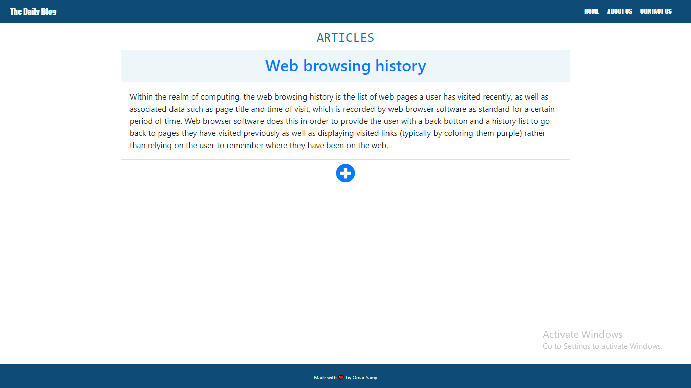
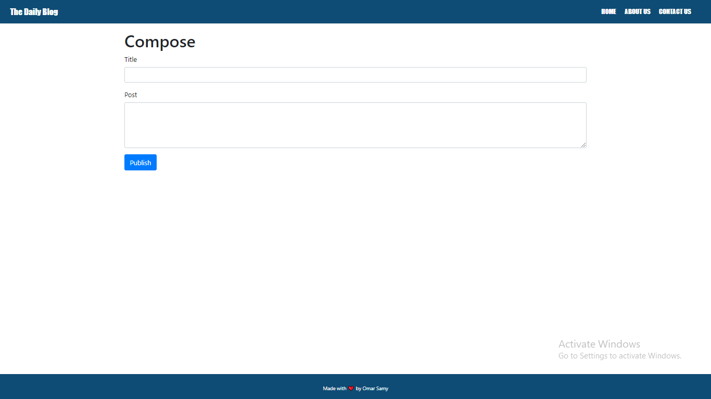

# The Daily Blog-

A simple blog website Implemented in Node js and express and using MongoDB for the datebase

# Learning outcomes-
  * Node js
  * express
  * MongoDB
  * Mongoose
  * EJS
  
  # Images from the website-
   

   
